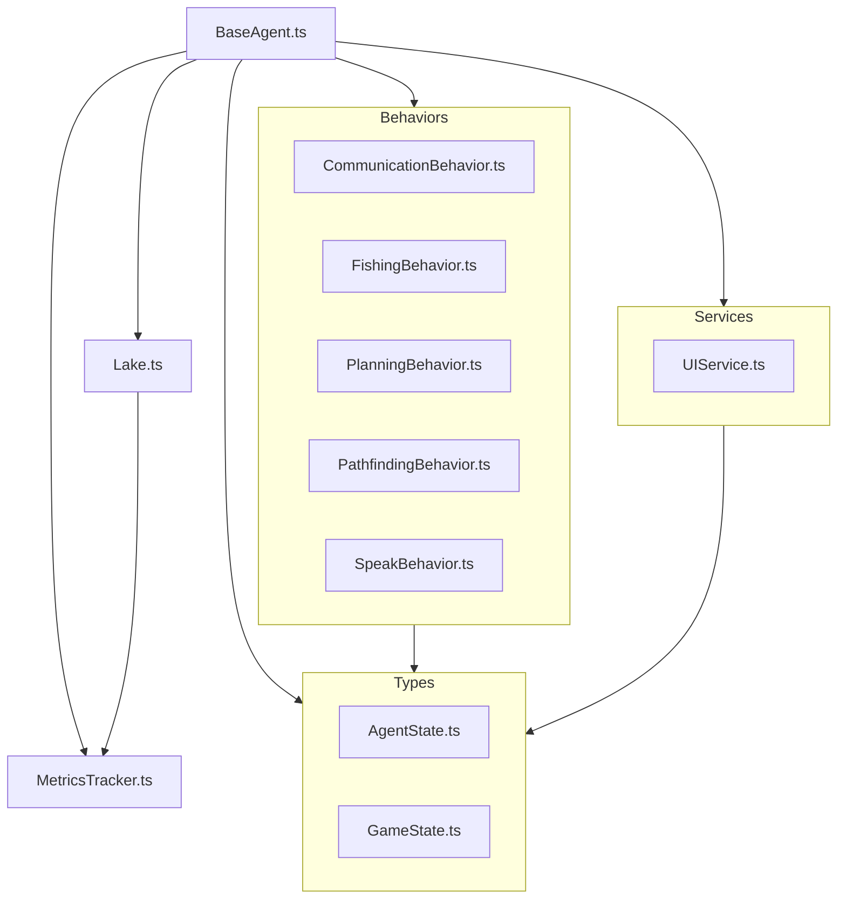
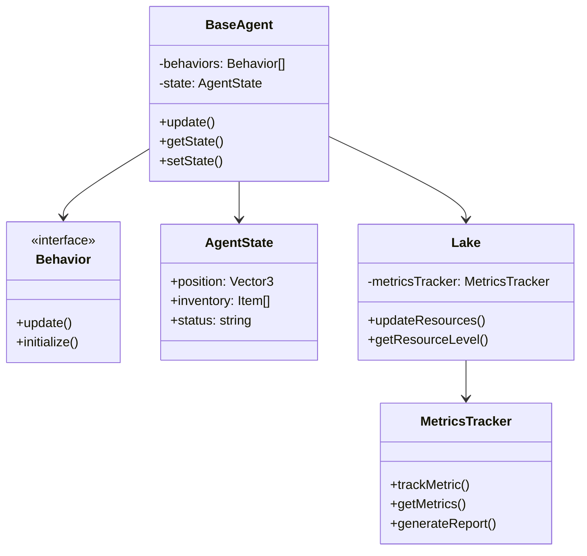
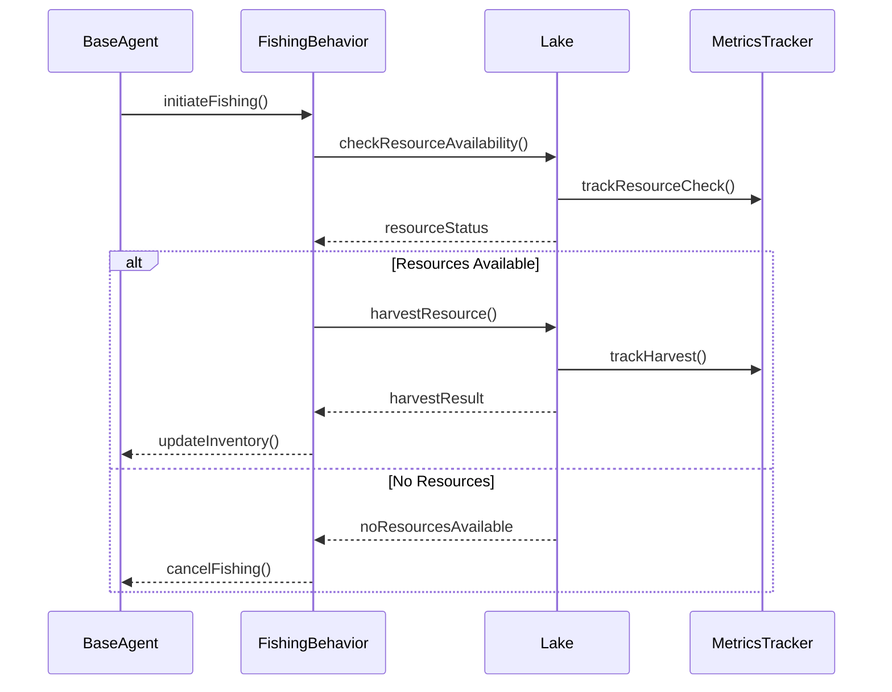
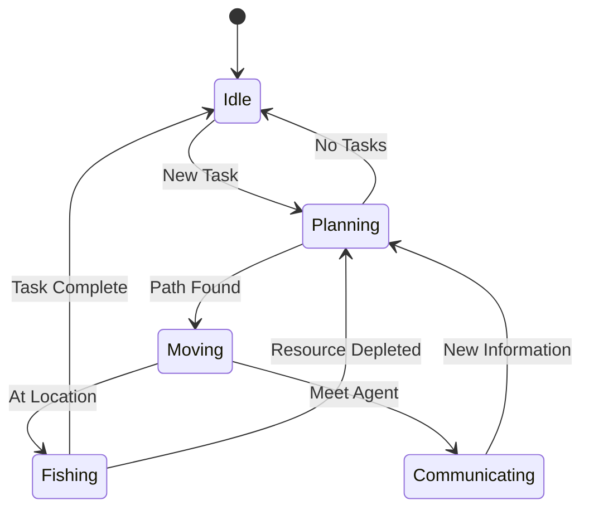
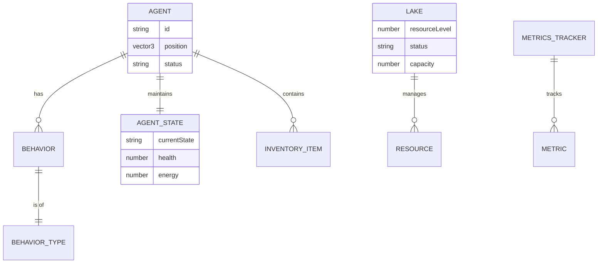
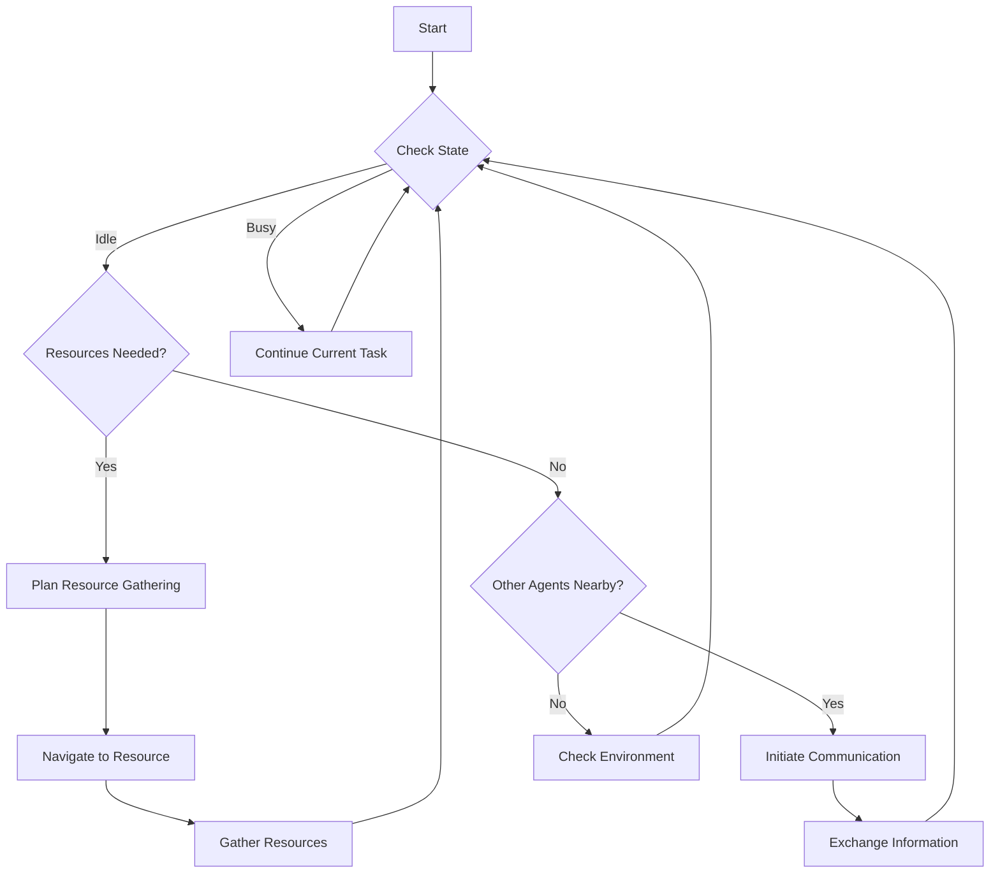

# CommonsKeeper Architecture

This document outlines the architecture of the CommonsKeeper project, which appears to be an agent-based system for managing resources and interactions.

## Component Relationship Diagram

## Class Diagram

## Sequence Diagram (Fishing Action)

## State Diagram (Agent States)

## Entity Relationship Diagram

## Flow Chart (Decision Making)

## Component Overview

### Core Components

1. **BaseAgent.ts**
   - Central agent implementation
   - Coordinates behaviors and services
   - Manages agent state and interactions

2. **Lake.ts**
   - Manages lake-related functionality
   - Likely handles resource management
   - Interacts with MetricsTracker

3. **MetricsTracker.ts**
   - Tracks system metrics and performance
   - Provides analytics and monitoring
   - Integrates with various components

### Behaviors

The system implements a behavior-based architecture with the following components:

1. **CommunicationBehavior.ts**
   - Handles agent communication protocols
   - Manages interaction between agents

2. **FishingBehavior.ts**
   - Implements fishing-related activities
   - Resource gathering mechanics

3. **PlanningBehavior.ts**
   - Handles strategic planning
   - Decision-making logic

4. **PathfindingBehavior.ts**
   - Navigation and movement logic
   - Path optimization

5. **SpeakBehavior.ts**
   - Manages agent speech/dialogue
   - Communication output

### Types

1. **AgentState.ts**
   - Defines agent state structure
   - Manages state transitions

2. **GameState.ts**
   - Global game state definitions
   - State management types

### Services

1. **UIService.ts**
   - User interface management
   - Display and interaction handling

## Architecture Patterns

The system follows several key architectural patterns:

1. **Behavior-Driven Design**
   - Modular behavior implementation
   - Separation of concerns through behavior classes

2. **Service-Oriented Architecture**
   - Dedicated services for specific functionalities
   - Clear service boundaries

3. **Type-Safe Implementation**
   - Strong typing through TypeScript
   - Clear state management

4. **Metrics and Monitoring**
   - Built-in performance tracking
   - System health monitoring

## Data Flow

1. The BaseAgent acts as the central coordinator
2. Behaviors implement specific functionalities
3. Services provide supporting features
4. Types ensure data consistency
5. MetricsTracker monitors system performance

## Logger Integration

The system includes a dedicated logger.ts for:
- System logging
- Debug information
- Error tracking
- Performance monitoring 